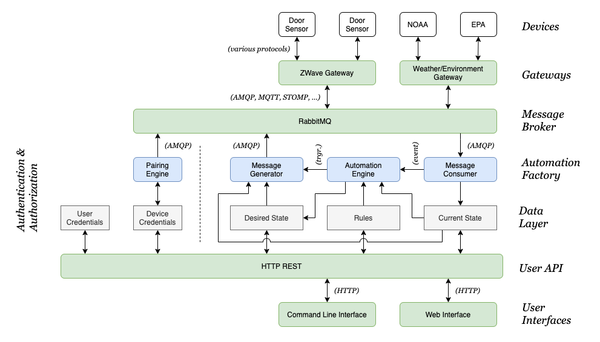

# General Requirements and Architecture

_Tilde_ is a modular, extensible, multi-purpose, automation platform with a focus on automating the home. At a very high level, such a platform is able to ingest data both from connected devices and internet sources, and send commands to connected devices that cause their state to change (e.g. light switch on/off).

## User Stories

These home automation focused user stories are selected to illustrate interaction with both physical devices and web resources, and various types of challenging logic. 

1. I come home from work: the entry lights automatically come on.
2. An intruder alarm is activated: all of the lights come on, a siren sounds, a text message is sent, and surveillance cameras begin recording at their highest resolution. 
3. There is a severe weather alert: widows close, a text message is sent. 
4. The soil is too dry: but it is going to rain later so irrigation isn't activated.
5. I manually turn a light on in the bathroom, then I leave the room without turning it off: the light turns off automatically after a delay.
6. I open a window because it's a nice day: climate control systems turn off or adjust their settings appropriately until it is closed. 
7. The house is too warm (due to cooking): it is cooler outside than inside, the windows open to ventilate instead of using the air conditioner, unless it is raining or pollen levels are too high.
8. During the day, I'm watching a movie. Starting the movie has changed living room lighting settings. The movie runs into the night. When the movie ends the room should converts to night time lighting, not day time. 

## General Requirements

1. Must be able to send or receive data to or from any type of networked device.
2. New classes of devices must be able to be integrated into the system without modifying to core system code or stopping the system (hot-pluggable architecture).
3. Must be able to take actions based on events and the current state of connected devices (automation).
4. Must be able to store the history of device state.
5. Must not depend on an internet connections unless inherent to the device (e.g. a weather report from a web API).
6. Must be resilient against devices going offline.

## Gross Architecture

A complete _Tilde_ system consists of seven major types of components. Each component is a separate service (service-oriented architecture). 

- **Devices:** _Devices_ can be connected physical objects such as light switches, thermostats, and door sensors. _Devices_ can also be virtual entities such as a weather report for a certain location or a Twitter feed. _Devices_ communicate with a _gateway_.
- **Gateways:** _Gateways_ connect to both the _message broker_ and _devices_ and act as an intermediary between them. _Gateways_ will typically implement a single IoT protocol such as Z-Wave, or interact with one or several closely related web services. _Gateways_ are software and may exist on the same hardware as the _core_ or their own hardware.
- **Message Broker:** The _message broker_ implements one or more protocols (AMQP, MQTT, STOMP) and routes messages between the _gateways_ and _core_.
- **Core:** The system has a single _core_ which consists of at a minimum the Automation Factory. ("Automation Factory" on diagram)
- **Data Layer:** The _data layer_ is implemented in a database.
- **User API:** An HTTP REST API that _user interfaces_ interact with. 
- **User Interfaces:** Users use _user interfaces_ to interact with the system.
- **Configuration Files:** Basic system configuration is stored in configuration files (not shown).

## Automation Architecture

### Current State

A data structure that stores the current states of _devices_.

### Desired State

_NOTE: I am actively redesigning the structure of desired state. The primary issue with the previous "layered state" is that it doesn't handle manual overrides (e.g. turning on a light switch) very well._

### Rules

Rules are used to determine what the Desired State should be based on the Current State. 

### Automation Data Flow

1. A _gateway_ receives an update from a _device_ regarding its state. 
    - "it is now raining"
2. The _gateway_ sends a message containing the _device_ state change to the _message broker_.
3. The _automation factory_ receives the message from the _message broker_. 
4. The Message Consumer updates the Current State data structure and passage the event to the Automation Engine.
5. The Automation Engine executes Rules and updates the Desired State.
6. The Message Generator compares Desired State to Current State and sends messages to the _message broker_ addressed to the appropriate _gateways_ requesting that they change the state of one or more of their _devices_.
    - "close windows, turn off irrigation"
7. The _gateways_ send messages to the _message broker_ when their _device_ states change.
    - "windows are closed, irrigation is off"

There is a potential for infinite loops of the above and measures should be taken in the Automation Factory to prevent such loops. 
